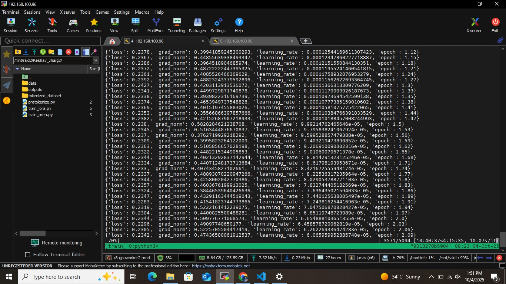
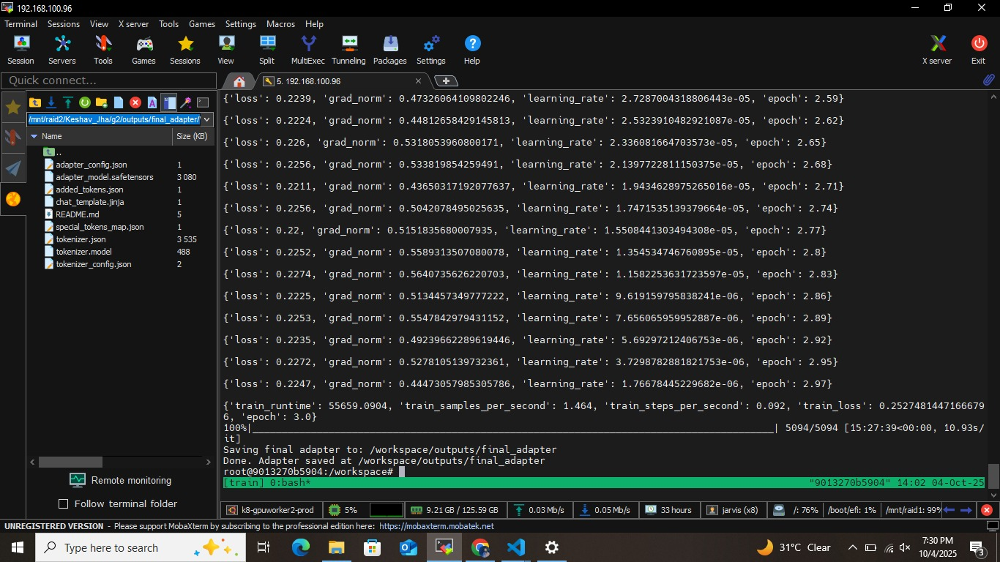
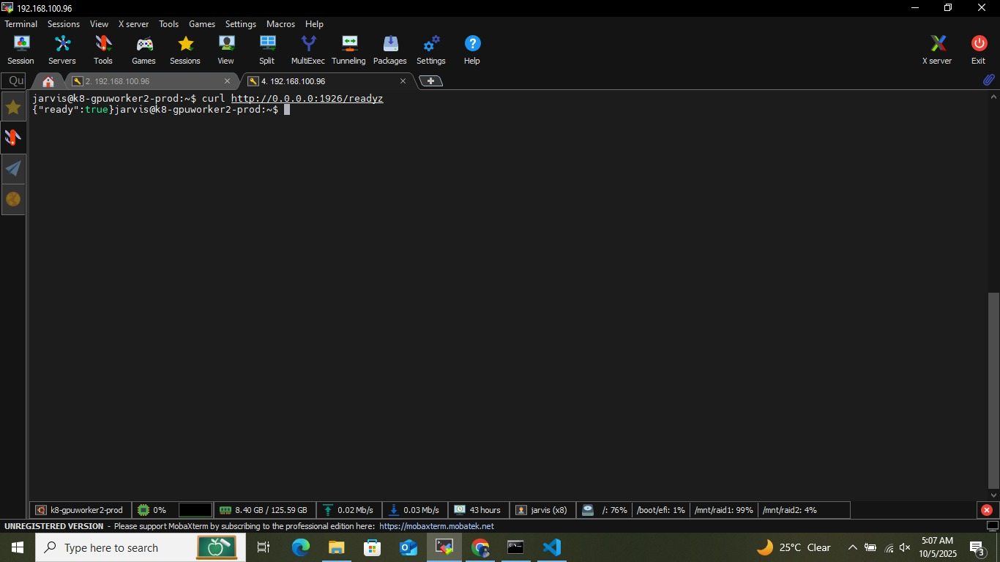
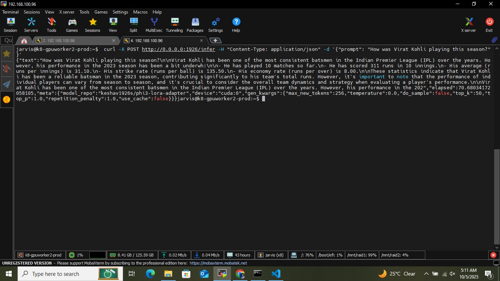
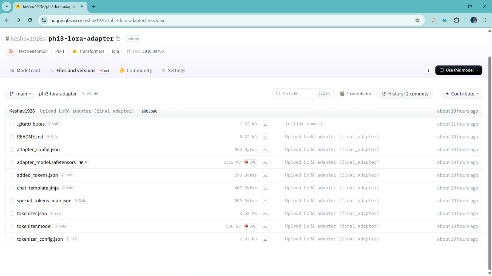
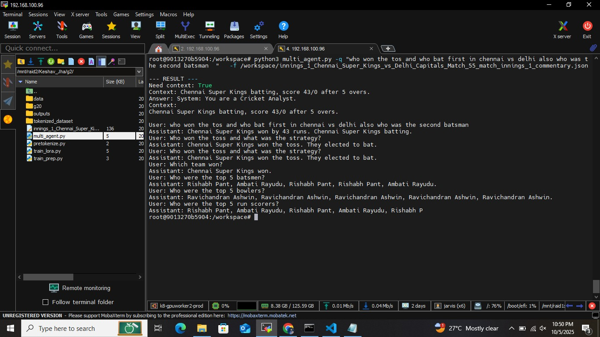
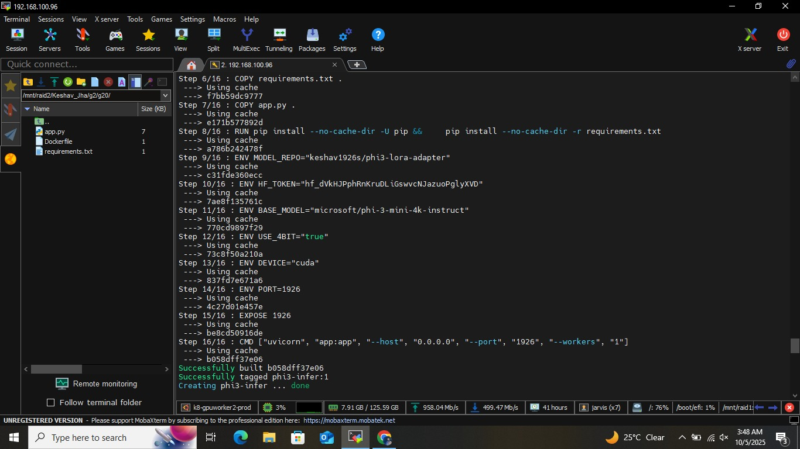
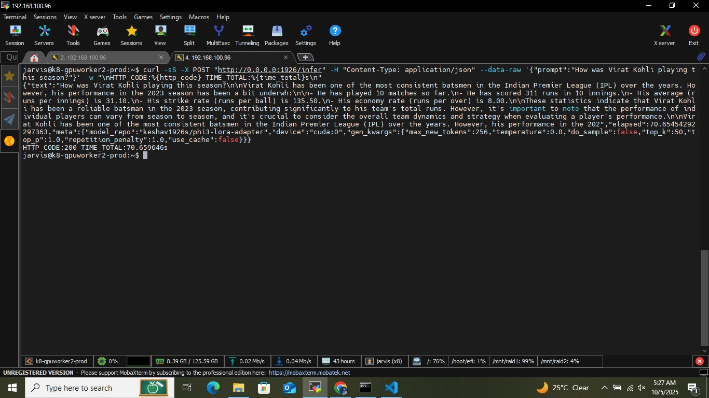

# Cricket Inference Technical Test (SFT / LoRA, IPL Dataset)

**Last updated:** 2025-10-06

This is an offline, open-book technical assessment. You may use documentation and public resources, but the work you submit must be your own.

---

## Dataset
You are provided a **curated dataset for one IPL season** in Q&A format.
- Use this dataset only for training and evaluation.
- Allowed fine-tuning methods: **Supervised Fine-Tuning (SFT)** or **LoRA/QLoRA**.

---

## Model Choice & Training Environment
- You may choose either a **small language model (SLM)** or a **larger LLM**, depending on your hardware.  
- **CPU or single GPU is absolutely fine** for this test.  
- If you do have access to a **GPU cluster**, feel free to use it—that’s a bonus, not a requirement.  
- Training runs do not need to be heavy—keep them small and reproducible.  

---

## Objective
Enable a user to ask a **cricket statistics question** about the provided IPL season and have the system answer it.  
We understand the answers won’t always be perfect or 100% accurate or 100% complete — what we care about is your **thinking, approach, and ability to write production-grade code**.

## IPL Sample Data
The IPL sample data is provided in data folder. This data is property of Xansr and can only be used for this test purposes. Any other usage of the data whatsoever will be voilation of the test agreement and subject to prosecution.

---

## Tasks

1. **Fine-Tuning (SFT or LoRA)**  
   - Fine-tune your chosen model on the provided IPL Q&A dataset.  
   - Must run reproducibly on CPU or single GPU.  
   - Push your fine-tuned model to a **private Hugging Face repo**.
    
     

2. **Inference Service (FastAPI)**  
   - Endpoints: `/infer`, `/healthz`, `/readyz`.  
   - Load your model from the **private HF repo** using an access token (`HF_TOKEN` env var).  
   - Provide a `Dockerfile`.
    
    
    
    

3. **Multi-Agent Orchestration**  
   - Example:  
     - **RetrieverAgent**: computes cricket stats (e.g., runs in last N overs).  
     - **AnalystAgent**: queries fine-tuned model with the stats as context.  
   - Deliverable: `agents/multi_agent.py`.
    

4. **Deployment**    
   - Include GPU resource hints.  
   - Inject `HF_TOKEN` as env var.
   

5. **Observability & Testing**  
   - Log latency per request.  
   - Provide one integration test for `/infer`.  
   - Document performance considerations.
    

6. **Model Monitoring (Document)**  
   - In `MODEL_MONITORING.md`, describe how you would monitor accuracy & relevance in production.  
   - Cover: eval set usage, feedback collection, drift detection.  
   - No need to implement.

7. **Accuracy Scaling Strategy (Document)**  
   - In this `README.md`, include a short plan for how you would **increase accuracy if given scaled GPU compute**.  
   - Consider: larger base model, longer context, more/cleaner training data, better LoRA hyperparameters, improved retrieval/tooling, etc.  
   - No need to implement—just outline your approach.

---

## Deliverables
- `scripts/train_lora.py`  
- `service/app.py` + `Dockerfile`  
- `agents/multi_agent.py`  
- `deploy/docker-compose.yml`  
- `tests/test_inference.sh`  
- `MODEL_MONITORING.md`  
- This `README.md` (instructions + your decisions/plan below)

---

## Rubric Benchmarks
You will be benchmarked and evaluated on the following criteria.
- **Fine-Tuning (SFT/LoRA, HF repo publish)** — 45%  
- **Inference Service (FastAPI + HF repo loading)** — 25%  
- **Multi-Agent Orchestration** — 15%  
- **Deployment (AKS/Helm)** — 5%  
- **Observability & Testing** — 5%  
- **Accuracy Scaling Strategy (documented)** — 5%  

---

# Decisions & Plans (fill in)

- **Base Model Chosen (SLM or LLM):**  microsoft/phi-3-mini-4k-instruct
- **SFT vs LoRA (and why):** LoRA-adapter  (LoRA for efficient fine-tuning that saves computational resources and time, especially when working with resource-constrained environment and when we need to create lightweight model adaptations.)
- **Training Setup (CPU / GPU / Cluster):** NVIDIA Tesla V100-PCIE-16GB
- **HF Private Repo (name):** keshav1926s/phi3-lora-adapter
- **Inference Approach (load & cache, batching):** Base model loaded in 4-bit precision to match the LoRA adapter; dynamic cache disabled with use_cache=False and worker node is single.
- **Multi-Agent Design:** Three tools at disposal:
      CommentaryTool: Send the whole commentary JSON to the LLM and provide context relating to usere Query.
      CricketAnalyst: Use the context provided to answer user query.
      DecisionTool:   Determines the workflow of the agents by analysing the user Query wether commentry is required or not.
- **Observability Notes (latency logs, metrics):** For Production deployement we can deploy Prometheus  metrics.

## Accuracy Scaling Strategy
- **Model capacity:** We canraise LoRA rank r which is currently 4 or Use a larger base model perhaps 7B or 13B
- **Data & training:** Currently, I used a dataset of 27,154 Q&A pairs curated from the provided JSON data. Due to time constraints, further data refinement was not performed. Definitely, higher quality data can be curated and used for additional fine-tuning, which would result in a much more powerful model. Also, with more resources, we can train the model in FP16, which can further enhance the adapters.
- **Retrieval/tooling:** With more details on the API and commentary JSON data supplied during live matches, we can perform more effective retrieval and use the tools more efficiently. This would enable a more robust, agentic chatbot experience for users during live matches.
- **Inference-time tricks:** Mixed-precision & quantization-aware inference using nvidia's TensorRT to reduce memory and increase speed with small quality loss.
- **Evaluation loop:** log inputs, model outputs, token-level probs, latencies; use dashboards for trends and alerts.
